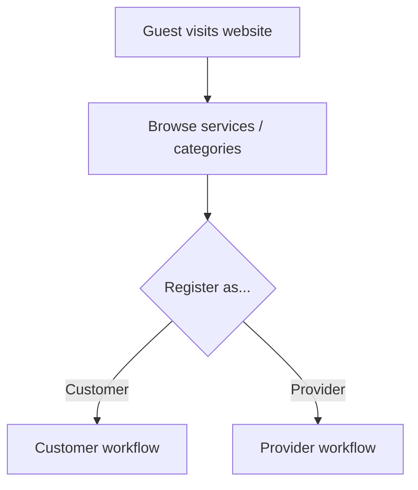
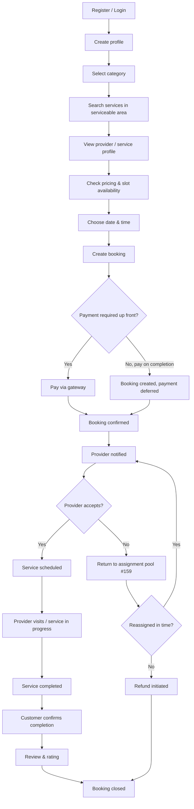
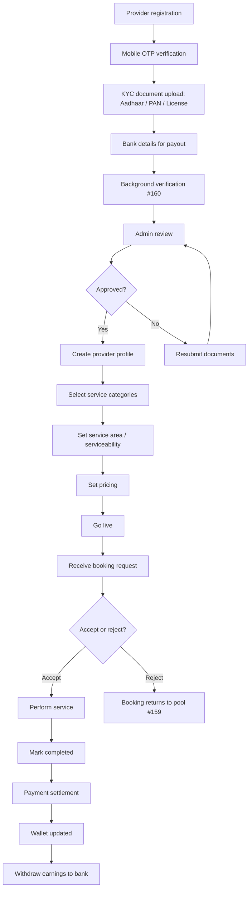
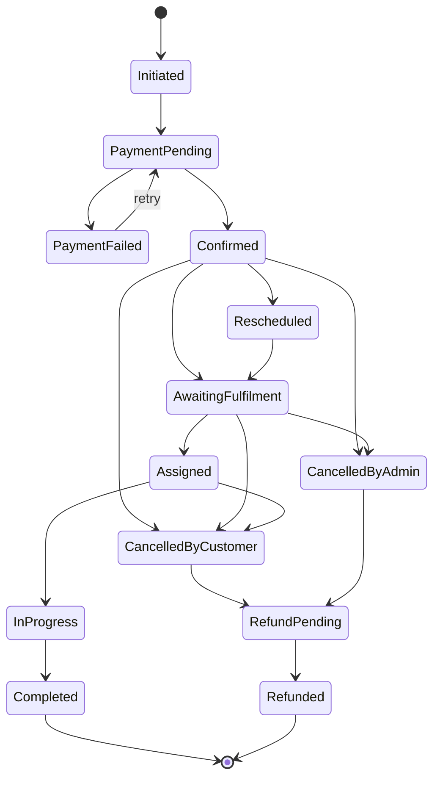
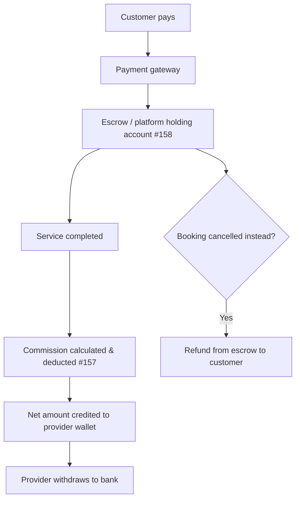
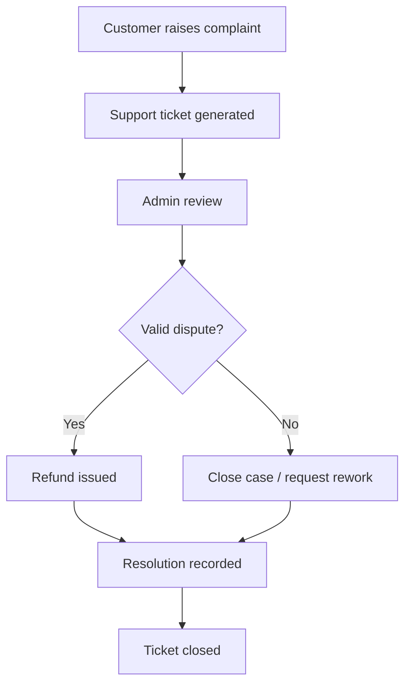
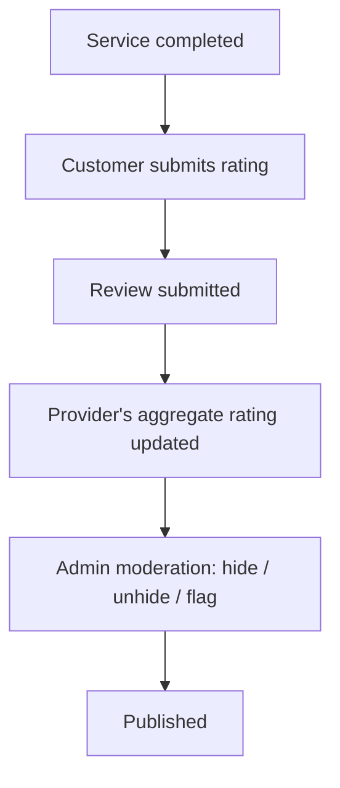
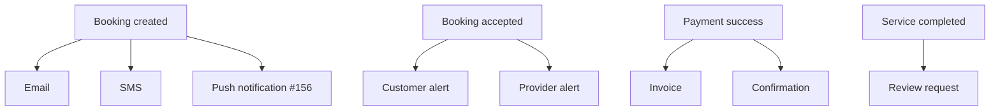
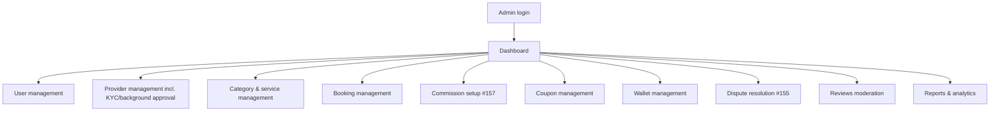

# Nestly — Workflow Diagrams

## PURPOSE

A visual map of how the marketplace actually works, end to end, for anyone
getting oriented on the project — product, QA, a new engineer, or an
external reviewer. It answers "what happens when...", not "which class does
this."

This document is **not authoritative**. It is a diagram companion to the
documents that already own these topics — [SRS.md](SRS.md) for functional
requirements and the booking lifecycle, [PROVIDER.md](PROVIDER.md) for the
service-provider module, [tasks.csv](tasks.csv) for what's built vs.
outstanding. Where a diagram here and the SRS disagree, the SRS is correct
and this file is stale.

Source: reconciles the original product workflow sketch (`Urban.docx`,
repository root) against the current SRS and backlog. Six flows the sketch
implied but the backlog didn't yet have tasks for were added to
[tasks.csv](tasks.csv) as #155–#160 (dispute resolution, push notifications,
commission setup, escrow, provider reassignment, background verification) —
they appear below as real flows, not aspirational ones.

**One naming note up front:** the person doing the job is the **Service
Provider** — called **Provider** throughout the code, database, and docs
(see PROVIDER.md).

---

## 1. Entry Point

Every visitor lands here before splitting into a Customer or a Provider.



---

## 2. Customer Workflow

The core booking journey, from registration through to a closed booking.
Provider acceptance is where SRS 13 branches: rejection returns the booking
to the assignment pool for reassignment rather than jumping straight to
refund (task #159) — refund is the fallback only if no provider picks it up in
time.



---

## 3. Provider Workflow (Service Provider)

Provider onboarding, going live, and earning. KYC document upload and
background verification (#160) are two distinct steps in the real backlog,
not one — a submitted Aadhaar/PAN scan being well-formed is not the same
check as the person behind it having a clean background.



---

## 4. Booking State Machine

The diagrams above describe the *experience*; this is the actual state
machine behind it (`BookingStatus`, SRS 13.1 — see
[Booking.cs](../backend/shared/Domain/Booking.cs)). It has more real states
than a product sketch usually shows, because failure and cancellation paths
matter as much as the happy path.



---

## 5. Payment Workflow

Money's path from customer to provider, including the platform's cut. The
holding step and the commission step are each their own backlog item (#158,
#157) — before those, the payments schema went straight from transaction to
refund/wallet with no explicit holding period or platform-commission
calculation.



---

## 6. Dispute Workflow

Formalizes the branch SRS calls out under support ("wrong charge / pricing
dispute") into its own flow — distinct from a general support ticket, which
may never need this valid/invalid split (#155).



---

## 7. Review & Rating Flow



---

## 8. Notification Flow

SMS and email dispatch already exist in the backlog (#31, #87); push is the
one channel that didn't (#156) — this flow treats all three as one dispatch
fan-out per event, not three separate implementations.



---

## 9. Admin Workflow

What the admin dashboard covers, grouped by the phase that builds it
(Phase 6 — see tasks.csv). Commission setup and dispute resolution are the
two sections tied to the previously-missing flows above.



---

## Where each flow lives in the backlog

| Flow | Primary phase(s) | Key task IDs |
|---|---|---|
| Customer booking journey | Phase 3 — Booking Core | #50–#65 |
| Provider onboarding & earnings | Phase 7 — Provider | #144–#149, #159, #160 |
| Payments, escrow, commission | Phase 4 — Payments & Financial | #67, #74, #157, #158 |
| Dispute resolution | Phase 5 — Post-Booking | #84, #86, #155 |
| Reviews & moderation | Phase 5 — Post-Booking | #85, #122, #123 |
| Notifications | Phase 5 — Post-Booking | #31, #87, #88, #156 |
| Admin dashboard | Phase 6 — Admin Panel | #90–#143 |
| Referral & growth (REFERRAL.md) | Phase 9 — Referral & Growth | #155–#176 |
| Subscription, recurring bookings, chat, completion verification (PRODUCT-ENHANCEMENTS.md) | Phase 10 — Product Enhancements | #177–#198 |
| Nestly Coins reorder loyalty (NESTLY-COINS.md) | Phase 11 — Nestly Coins & Loyalty | #156–#160 |

**Note on Provider's phase number**: moved from Phase 8 to Phase 7 on
2026-07-31 — it now runs *before* Hardening & Launch (Phase 8), not after
everything else. See PROVIDER.md's STATUS section.

**Known task-ID drift (flagged, not yet reconciled)**: this table's
Referral/Product-Enhancements ID ranges (#155–#198) describe tasks that were
never actually added as rows to [tasks.csv](tasks.csv) — that file's real
IDs stop at T151 (Provider) before jumping to T152+ (hardening/bug-fix tasks
added 2026-08-01/02, including T155–T165, which are unrelated to what this
table's "#155" etc. describe). Reconciling the two is its own cleanup task —
until then, treat this table's IDs as REFERRAL.md/PRODUCT-ENHANCEMENTS.md's
own internal numbering, not literal tasks.csv row IDs.

**Not yet diagrammed above**: the Referral, Product Enhancements, and Nestly
Coins flows are new since this document's diagrams were drawn (sections 1–9
predate Phase 9/10/11). The spec docs (REFERRAL.md, PRODUCT-ENHANCEMENTS.md,
NESTLY-COINS.md) are authoritative for those flows until diagrams are added
here.

For current status of any of these (done / todo / blocked), see the summary
rows at the top of [tasks.csv](tasks.csv) or run:

```bash
python3 /path/to/autopilot-local/tasklib.py counts tasks.csv
```
